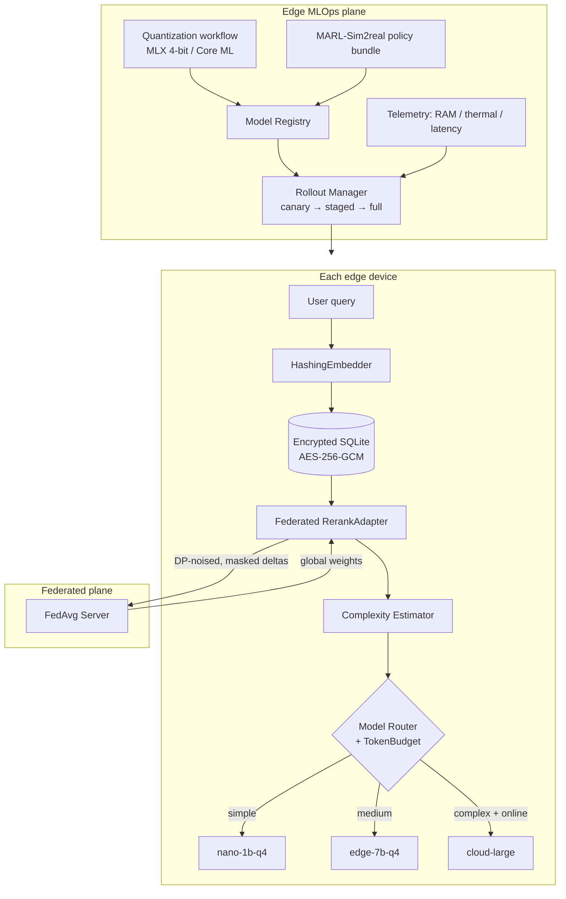

# EdgePack — Federated Multi-Agent Packing System with On-Device RAG

The edge half of a two-repo system. The companion repo **MARL-Sim2real**
trains the multi-agent packing policy (Proposer + Physics agents) and bridges
it across the reality gap; **this repo** runs everything on and around the
devices:

| Layer | Module | What it does |
|---|---|---|
| Encrypted on-device RAG | `edgepack/rag`, `edgepack/crypto` | Local vector search over an AES-256-GCM-encrypted SQLite database |
| Token-budget model routing | `edgepack/router` | Scores task complexity, routes each query to the cheapest capable model tier, downgrades under budget pressure |
| Federated learning | `edgepack/federated` | FedAvg over DP-noised, secure-aggregated re-ranker updates — raw documents never leave a device |
| 4-bit quantization workflow | `edgepack/quantization` | Llama 3 / Mistral → 4-bit via MLX (+ Core ML palettization) under explicit RAM & thermal budgets |
| Edge MLOps | `edgepack/mlops` | Model registry with promotion gates, device telemetry, canary→staged→full OTA rollout with auto-rollback |

Runs everywhere: the heavy Apple-Silicon deps (`mlx-lm`, `coremltools`) are
optional — on other hardware the quantization workflow executes the identical
pipeline in **dry-run** mode (budget checks, plan files, reports), so CI tests
the whole system.

---

## Architecture



## Quick start

```bash
pip install -e ".[dev]"
pytest -q                                    # 36 tests, ~2 s

# 1. encrypted RAG + complexity-routed generation + token accounting
python scripts/demo_rag.py

# 2. federated rounds across simulated devices
python scripts/run_federated_round.py --devices 4 --rounds 3

# 3. 4-bit quantization workflow (real on Apple Silicon, dry-run elsewhere)
python scripts/quantize_model.py --model mistralai/Mistral-7B-Instruct-v0.3 \
    --ram-limit 6 --bits 4 --coreml

# 4. deploy a MARL-Sim2real policy bundle through the MLOps plane
python scripts/deploy_policy.py --manifest ../MARL-Sim2real/artifacts/packing_policy_real.json
```

On an M-series Mac, install the real backends first: `pip install -e ".[apple]"`.

---

## Step-by-step: how each subsystem is built

### Step 1 — At-rest encryption (`edgepack/crypto/encryption.py`)

- **AES-256-GCM** (authenticated encryption) via the `cryptography` package.
- Key derived from a device passphrase with **scrypt** (N=2¹⁴ — interactive
  grade for edge CPUs); the random salt is the only plaintext metadata.
- Fresh random 96-bit nonce per record; the record ID is bound in as **GCM
  associated data**, so a ciphertext moved to another row fails authentication
  (`test_record_id_binding_prevents_swapping`).

### Step 2 — Encrypted vector store (`edgepack/rag/vector_store.py`)

Threat model: the SQLite file at rest (backups, stolen storage, cloud sync)
reveals nothing but row IDs.

- Text **and** embedding vectors are encrypted per record.
- At open, vectors are decrypted **into RAM only** and held as one normalized
  matrix → cosine top-k is a single matrix-vector product.
- Document text decrypts lazily, per returned hit.
- `test_store_data_is_encrypted_at_rest` greps the raw DB file for plaintext
  to prove the property.

### Step 3 — On-device embeddings (`edgepack/rag/embeddings.py`)

Default embedder is **feature hashing** over unigrams+bigrams (blake2b →
signed slots, sublinear TF, L2 norm): deterministic, zero model download,
microseconds per doc. The `Embedder` protocol lets you swap in a real
sentence encoder (e.g. 4-bit MiniLM via MLX) without touching store or
pipeline.

### Step 4 — Complexity-based model switching (`edgepack/router/model_router.py`)

This is the token-consumption control:

1. `ComplexityEstimator` scores each query 0–1 from cheap signals — length,
   reasoning verbs (*why/how/compare/derive*), multi-part structure, code
   presence, vocabulary spread, and **retrieval uncertainty** (weak local hits
   ⇒ harder task). Costs ~0 tokens itself.
2. `ModelTier`s are declarative: `capability` (max complexity it handles) and
   `cost_multiplier` (budget units per token). Defaults: `nano-1b-q4` (×1),
   `edge-7b-q4` (×4), `cloud-large` (×20, off-device).
3. The router picks the **cheapest tier whose capability covers the score** —
   big-model tokens are never spent on small-model tasks.
4. `TokenBudget` meters weighted spend. When a tier's worst-case cost no
   longer fits the remaining budget, the router **downgrades** tier by tier
   (`downgraded=True` in the decision), and only raises `BudgetExhausted` when
   even the cheapest tier can't fit. `offline=True` drops cloud tiers.

### Step 5 — RAG pipeline (`edgepack/rag/pipeline.py`)

Per query: encrypted retrieval → federated re-rank → complexity+budget routing
→ generation grounded in retrieved context → actual token usage charged back
to the budget. The `LLMClient` protocol keeps it model-agnostic; the default
`TemplateLLM` is a deterministic extractive stub so the full pipeline runs in
CI.

### Step 6 — Federated learning (`edgepack/federated/federated.py`)

What's learned: the 3-weight `RerankAdapter` (retrieval score, term overlap,
length prior) from **local click feedback** via pairwise hinge loss. What
leaves the device, in order of defense:

1. Only weight **deltas** — never documents or queries.
2. **DP**: clip to `clip_norm`, add Gaussian noise (`noise_multiplier`).
3. **Secure aggregation**: pairwise antisymmetric masks derived from shared
   seeds; each client's upload looks random, but masks cancel in the sum —
   `test_masked_sum_equals_true_sum` proves `sum(masked) == sum(true)` while
   `test_individual_masked_update_hides_true_update` proves the server can't
   read any single update.
4. **FedAvg** on the server, global weights broadcast back.

### Step 7 — Quantization workflow (`edgepack/quantization/`)

`QuantizationWorkflow.run()` = five gated stages, all reported to
`REPORT.json`:

1. **RAM budget** (`budget.py`) — analytic estimate: `weights(q-bit) +
   KV-cache(8-bit, context-length aware) + 15% runtime overhead`, checked
   against the device limit (e.g. 6 GB). The report also shows the fp16
   reference (~17 GB for a 7B) so the win is visible. Known geometries for
   Llama-3-8B/70B, Mistral-7B, Phi-3-mini.
2. **Thermal budget** — reads `/sys/class/thermal` (Linux) or `powermetrics`
   (macOS); an unreadable sensor is a *soft pass* (budgets must not make CI
   flaky), an over-limit reading defers quantization.
3. **MLX 4-bit conversion** — `mlx_lm.convert(hf_path, quantize=True,
   q_bits=4, q_group_size=64)`. Without MLX installed, writes the exact
   `PLAN.json` it would execute.
4. **Core ML export** (optional) — `coremltools` weight **palettization**
   (4-bit k-means LUT) for the Neural Engine.
5. **Verify** — re-estimate RAM; on real hardware also load the model and
   measure tokens/sec on a short generation.

Over-budget models **fail fast** at stage 1 and never reach conversion
(`test_workflow_fails_fast_when_over_ram_budget`: Llama-3-70B @ 4-bit ≫ 6 GB).

### Step 8 — Edge MLOps (`edgepack/mlops/mlops.py`)

- **ModelRegistry** — JSON-file store of versioned artifacts with SHA-256
  hashes; `promote()` gates on metric thresholds (e.g. block a packing policy
  whose real-world utilization is too low); `verify_artifact()` detects
  tampering before any rollout.
- **TelemetryCollector** — per-device RAM/thermal/latency windows with health
  rules mirroring the quantization budgets.
- **RolloutManager** — canary (5%) → staged (50%) → full OTA progression,
  each advance gated on the health of already-updated devices; an unhealthy
  canary triggers automatic rollback.

### Step 9 — Closing the loop with MARL-Sim2real

`scripts/deploy_policy.py` takes the manifest exported by MARL-Sim2real's
`run_bridge.py` (weights hash + reality-gap metrics), registers it, promotes
it only if `real_utilization` clears the bar, then walks the health-gated
rollout. The packing policy, the quantized LLM, and the federated adapter all
ship through the same registry/rollout machinery.

---

## Token-frugal by construction

The routing layer exists to keep token consumption bounded and observable:

- complexity scoring is lexical (free) — no "ask a big model whether the task
  is hard" bootstrap cost;
- cheapest-covering-tier selection means routine queries never touch the 7B,
  let alone the cloud;
- the budget is a hard envelope with graceful degradation (downgrade → then
  fail loudly), and `usage_summary()` gives per-tier calls/tokens/cost for
  audit.

## Repository layout

```
edgepack/
├── crypto/encryption.py      # scrypt KDF + AES-256-GCM record cipher
├── rag/
│   ├── embeddings.py         # hashing embedder + cosine top-k
│   ├── vector_store.py       # encrypted SQLite vector DB
│   └── pipeline.py           # RAG pipeline + federated re-ranker + LLM protocol
├── router/model_router.py    # complexity estimator, tiers, token budget, router
├── federated/federated.py    # DP + secure aggregation + FedAvg client/server
├── quantization/
│   ├── budget.py             # RAM/thermal budget models, model geometries
│   └── workflow.py           # 5-stage MLX/Core ML quantization pipeline
└── mlops/mlops.py            # registry, telemetry, canary rollout
scripts/                      # demo_rag, run_federated_round, quantize_model, deploy_policy
tests/                        # 36 tests
```

## License

MIT — see [LICENSE](LICENSE).
